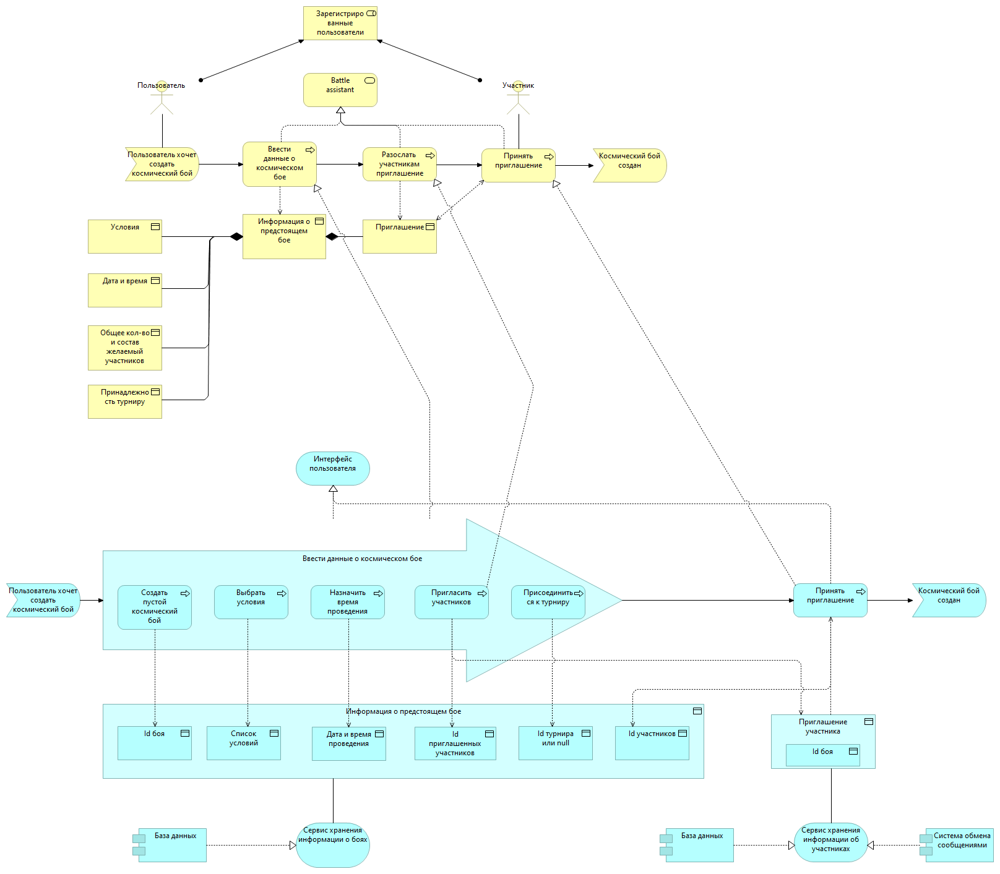

# Architecture

## Техническое задание
Космические бои могут проводить только зарегистрированные пользователи. Космические бои проводятся как в рамках турниров, либо между любыми пользователями по договоренности.
Можно посмотреть список будущих турниров, подать заявку на участие в турнире, посмотреть результаты проходящих турниров, уже прошедших.
Участники боев получают уведомлении о приглашении на турнир, решение по заявке на участие в турнире, о завершении боя, о скором начале боя. Игорок может посмотреть прошедший бой. За места в турнире участники получают рейтинговые очки.
Каждый пользователь может организовать свой турнир. Турниры получают рейтинг, который рассчитывается на основе рейтингов ее участников. Турнир может быть регулярным, тогда рейтинг его накапливается.
Игрок принимает участие в игре посредством программы, которая загружается в специальное приложение Агент.

## Моделирование

Создание нового боя

Присоединение участника к бою

Создание нового турнира

Присоединение участника к турниру

Для решения поставленной задачи требуются сервисы:
1. Сервис хранения информации о боях - Battle Assistant
2. Сервис хранения информации о турнирах - Tournaments
3. Сервис хранения информации об участниках - Users
4. Веб - интерфейс пользователя
5. Agent - интерфейс пользователя для участия в игре
6. Arena - игровой сервер
Вспомогательные сервисы:
7. Сервис авторизации
8. Сервис сообщений.

[Battle Assistant API](./arhi/battle assistant.md)

[Tournaments API](./arhi/tournaments.md)

Узким местом может оказаться игровой сервер Arena, поскольку на нем предполагается "online" игра множества пользователей.
Чтобы избежать этого, предполагается создавать свой сервис Arena для каждого боя, т.е. под одну игру.
Будут меняться требования к условиям игры, поэтому необходимо выделить логику создания, сохранения и изменения условий игры в отдельный сервис 
и в информацию о бое передавать идентификатор условий.

